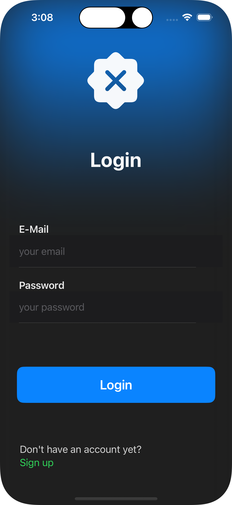
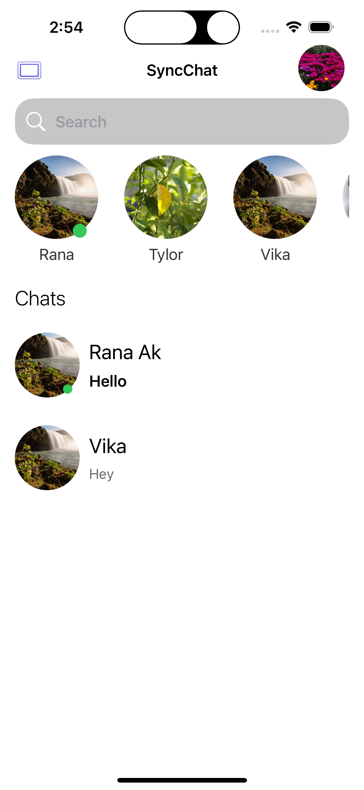
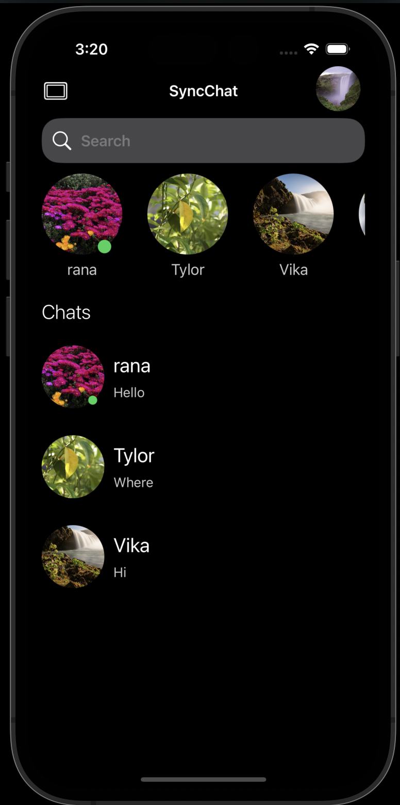
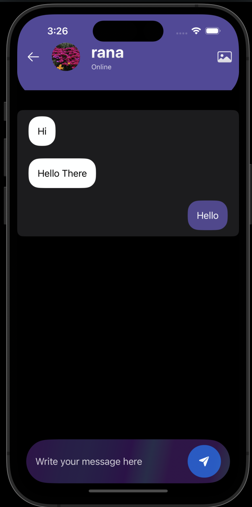

<!-- # SyncChat
A cloud based Chat application -->
<p>
  
  <span style="vertical-align:middle;"># SyncChat App !</span>
</p>


SyncChat is an advanced real-time messaging app for iOS, built with **Swift** and **Firebase**. It offers an intuitive chat experience with features like image sharing, live status updates, profile management, and much more. This app ensures seamless interaction with instant messaging, read receipts, and cached data for performance.

<p align="left" style="display: flex; justify-content: space-between; flex-wrap: wrap;">
  
  
  
  
</p>

## ✨ Features

- **User Authentication**: Secure login and signup with Firebase Authentication.
- **Profile Management**: Update profile picture, name, and password anytime.
- **Real-Time Messaging**: Instantly send text and image messages, or even a blank message to knock. 📨
- **Read Receipts & Unread Messages**: Track message status with color-coded visuals.
- **Conversation Sorting**: Latest messages appear at the top, with unread ones in bold.
- **Timestamps**: Tap on messages to see when they were sent. ⏲️
- **Light & Dark Mode**: Toggle between light and dark modes with one click. 🌗
- **Online Users**: See who is currently online and available to chat.
- **Search Users**: Easily find and start conversations with any user.
- **Message Deletion**: Delete individual messages from the conversation.
- **Temporary Cached Data**: Cache stores data temporarily to save storage and improve performance.
- **Firestore Integration**: Store and sync messages, profiles, and statuses with Firestore.

## 📹 Preview

<p align="center">
  
</p>

*This demo shows the login process, real-time messaging, and the user-friendly interface.*

## 🎨 Key Features

```bash
# Authentication
Login & Signup: Users can create new accounts or log in using their email and password. Firebase Authentication handles user verification, making the process secure and efficient.
Profile Management: Users can update their profile picture, change their name, and reset their password directly within the app.

# Messaging
Real-Time Conversations: Messages are instantly updated across all users.
Text & Image Support: Users can send text messages and images. Even blank messages (or "knocks") can be sent to get someone's attention.
Read Receipts & Unread Messages: Messages are color-coded based on their read status. Once a message is read, its color changes. Unread messages appear bold in the conversation list, making it easy to see what you haven't yet viewed.
Tap for Timestamps: Tapping on any message reveals the timestamp, giving context for when a message was sent or received.
Delete Messages: Users can delete individual messages from the conversation, ensuring privacy and control over their data.

# UI and Appearance
Light and Dark Mode: With a single click, users can switch between light and dark modes for the entire app.
Auto-Sorting Conversations: The latest conversations appear at the top of the list. If a conversation has unread messages, it’s displayed in bold, making it easy to identify.

# User Interaction
Search Users: Find any user in the system by searching. Start conversations with any online or offline user.
Online Users: See which users are online in real-time. This feature is perfect for identifying who’s available for an instant chat.

# Cache Support
The app temporarily caches user data after login, reducing unnecessary data downloads and saving on device storage. Cached data is cleared when the app is closed from the background for better performance.

# Data Storage
Firestore Integration: All user and chat data is stored securely in Firestore. Messages, user profiles, and online statuses are constantly synced with the cloud, ensuring no data is lost.


```
## 🚀 Installation

Follow these steps to get the app running locally:

```bash
# Clone the repository
git clone https://github.com/RanaAk/SyncChat.git

# Open the Xcode workspace
open SyncChat.xcworkspace

# Set up Firebase
# 1. Create a Firebase project.
# 2. Enable Firestore and Firebase Authentication.
# 3. Download the GoogleService-Info.plist file and add it to the Xcode project.

# Build and run the app on a simulator or device.

```
## 🔧 Technologies Used


- <span style="color: rgb(112, 188, 105); font-weight: 450; font-style: italic;">#SwiftUI:</span> SwiftUI framework to build responsive UIs.
- <span style="color:rgb(112, 188, 105); font-weight: 450; font-style: italic;">#Firebase Authentication:</span> Manage user authentication securely.
- <span style="color:rgb(112, 188, 105); font-weight: 450; font-style: italic;">#Firestore:</span> Real-time data storage and sync.
- <span style="color:rgb(112, 188, 105); font-weight: 450; font-style: italic;">#Firebase Storage:</span> Store and manage chat images.
- <span style="color:rgb(112, 188, 105); font-weight: 450; font-style: italic;">#Swift Concurrency (async/await):</span> To manage asynchronous operations smoothly.


## 📈 Future Features

- <span style="color: rgb(112, 188, 105); font-weight: 450; font-style: italic;">Push Notifications:</span> Real-time notifications for new messages.
- <span style="color: rgb(112, 188, 105); font-weight: 450; font-style: italic;">Voice & Video Calls:</span> Enable users to start voice or video conversations.
- <span style="color: rgb(112, 188, 105); font-weight: 450; font-style: italic;">File Sharing: </span>Share documents and files along with messages.
- <span style="color: rgb(112, 188, 105); font-weight: 450; font-style: italic;">Custom Emojis:</span> React to messages with emojis.
